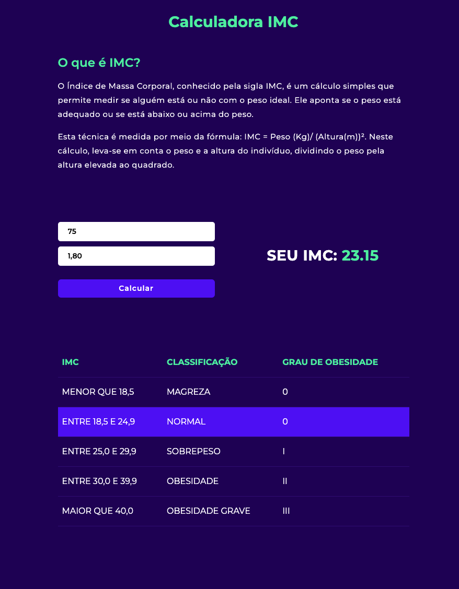

<h2 align="center">IMC</h2

<br>

<p align="center">Calcule o seu IMC, digite seu peso e sua altura e descubra o seu IMC. Tabela disponível para saber em que classificação que você se encaixa.</p>

<br>



<br><br>

## ↗ Mais:
- Projeto simples para testar habilidades do framework VueJS 
- Components
- V-MODEL
- CLICK
- VALIDAÇÃO
- ETC...

## 🛠️ Tecnologias:
- VUEJS
- JAVASCRIPT
- BOOTSTRAP

## 📍 Deploy:
- <a href="https://imc-rosy.vercel.app/">CLIQUE AQUI PARA VER O PROJETO</a>

<br>

```
git clone https://github.com/paulopariz/IMC.git
```

```
cd IMC
```

```
yarn install
```

```
yarn serve
```

<br><br>


<h2 align="center">Contato:</h2>
<div align="center">

 <a href= "https://api.whatsapp.com/send?phone=5544999575376"></a> <a href="https://www.instagram.com/parizpaulo_/" style="margin-left:10px"></a> <a href="paulopariz01@gmail.com" style="margin-left:10px"></a> <a href="https://www.linkedin.com/in/paulopariz/" style="margin-left:10px"></a>

 </div>
